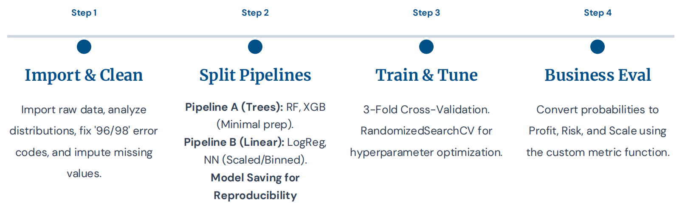
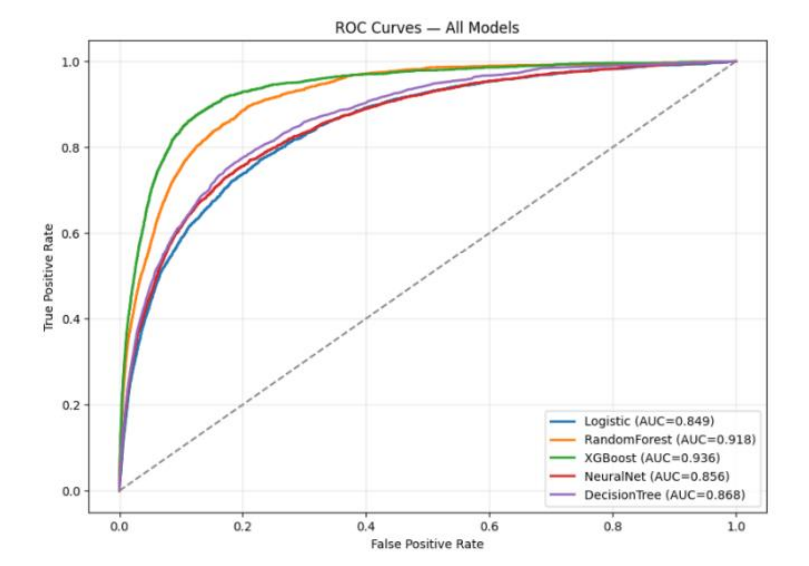
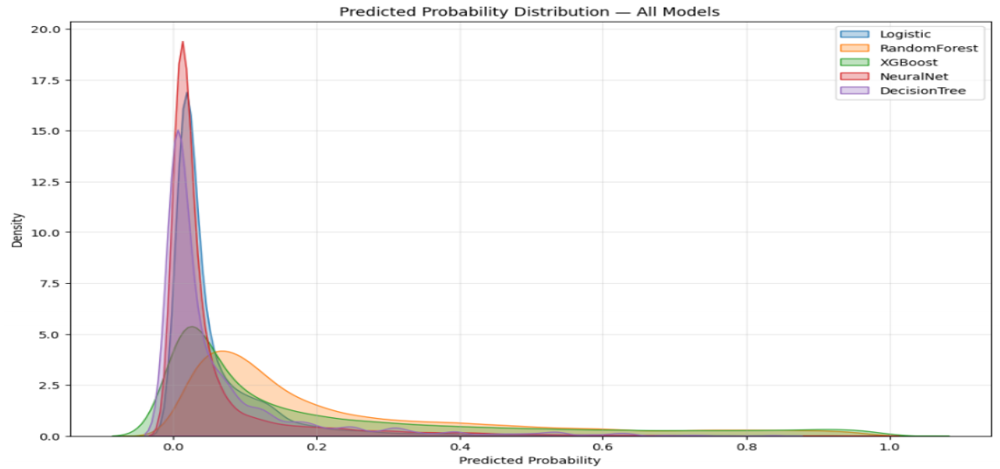
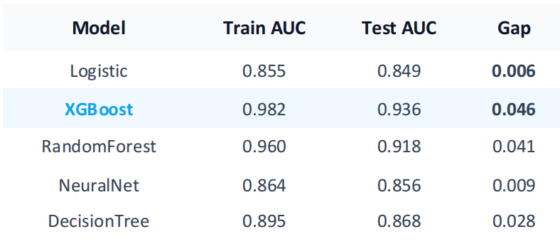
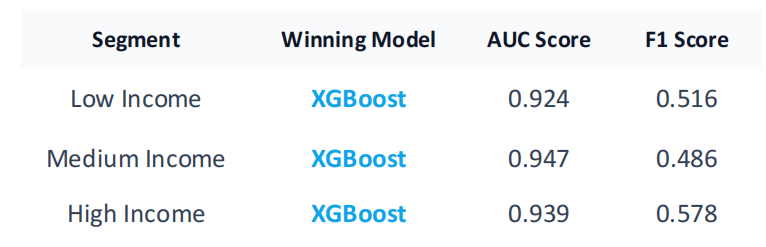
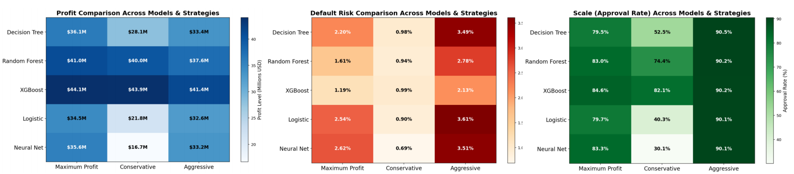

# Credit Risk Threshold Optimization

This project develops a **data-driven credit risk modeling and decision framework** that connects machine learning predictions with **real business objectives**.  
Rather than stopping at model accuracy, the project translates predicted default probabilities into **profit, risk, and approval-rate trade-offs**, enabling strategy selection aligned with different risk appetites.

---

## Project Motivation

Credit risk decision-making is inherently **asymmetric**:

- A good loan generates limited upside
- A bad loan can cause large principal losses

As a result, **choosing the right probability threshold** is often more important than choosing the most accurate model.

This project addresses that gap by combining:
- Predictive modeling
- Probability-based decision rules
- Scenario-driven business optimization

---

## End-to-End Analysis Pipeline

The full workflow follows a structured, production-style pipeline from raw data to business decisions.

Key stages include:
- Data cleaning and anomaly handling
- Feature engineering
- Model training and validation
- Probability calibration
- Threshold optimization under multiple strategies

---

## Modeling Framework

### Machine Learning Layer
Multiple models are trained and compared, including:
- Logistic Regression
- Decision Tree
- Random Forest
- XGBoost
- Neural Network

Models are evaluated on:
- ROC-AUC
- Default-class F1 score
- Probability separation quality

---

### ROC Performance Comparison

ROC curves reveal that tree-based models achieve stronger ranking power, particularly for separating high-risk borrowers.

XGBoost consistently provides the strongest discrimination between defaulters and non-defaulters.

---

## Predicted Probability Behavior

Instead of relying on binary predictions, the analysis focuses on the **full probability distribution**, which is essential for threshold-based decisions.

Stronger models spread defaulters toward higher predicted probabilities, enabling more flexible risk control.

---

## Stability and Generalization

Model performance is evaluated across training and test sets to assess overfitting risk.

- Logistic and Neural Network models are stable but weaker
- Tree-based models show modest overfitting but substantially higher predictive power
- The trade-off is acceptable given the business gains

---

## Segment-Level Analysis

Model performance is further evaluated across borrower income segments.

Key findings:
- XGBoost dominates across low-, medium-, and high-income groups
- Ranking consistency indicates robustness
- Simpler models fail to improve meaningfully in higher-income segments

---

## Business-Oriented Threshold Optimization

Instead of using a fixed 0.5 cutoff, the project defines **three strategic modes**:

- **Balanced**: maximize total profit
- **Conservative**: cap default risk (downturn scenario)
- **Aggressive**: maximize approval rate (growth scenario)

Each threshold is chosen by converting predictions into:
- Portfolio profit
- Default risk
- Approval scale

---

## Business Impact Comparison

The final evaluation translates model outputs into **economic outcomes**, not just statistical metrics.

Key conclusions:
- XGBoost delivers the highest profit across all strategies
- Default risk is substantially lower than weaker models
- Random Forest serves as a strong, stable second choice

---

## Key Takeaways

- Probability thresholds matter more than raw accuracy
- Business objectives must drive model decisions
- XGBoost offers the best balance of profit, risk control, and scalability
- A single model can support multiple strategies through threshold adjustment

---

## Disclaimer

This project is for **research and demonstration purposes only**.

- Results depend on historical data and modeling assumptions
- Financial parameters are illustrative
- Outputs do not constitute lending or investment advice

---

